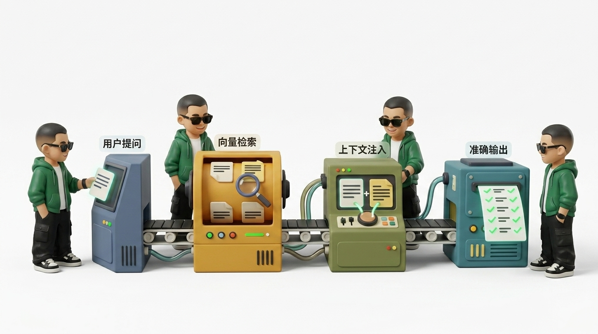
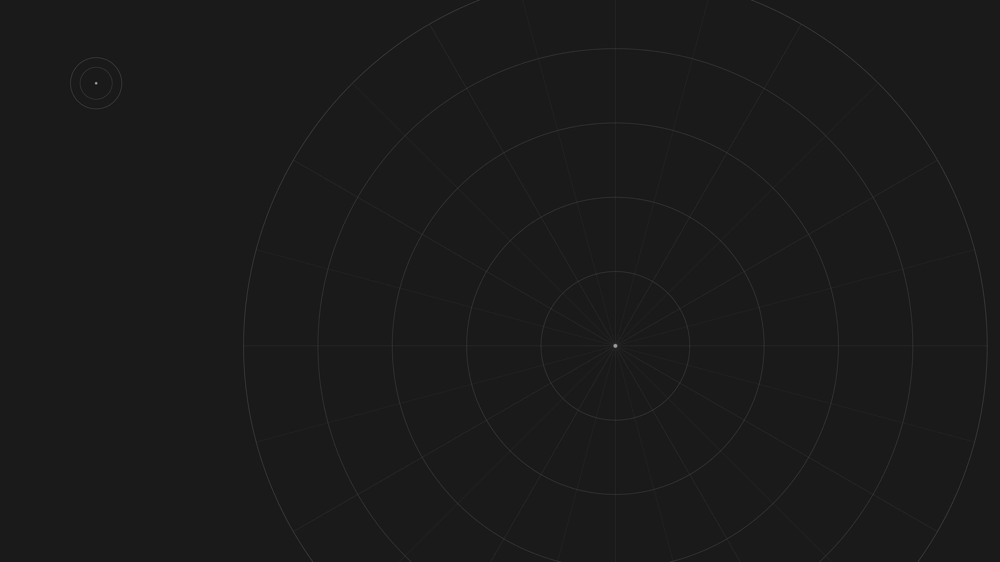
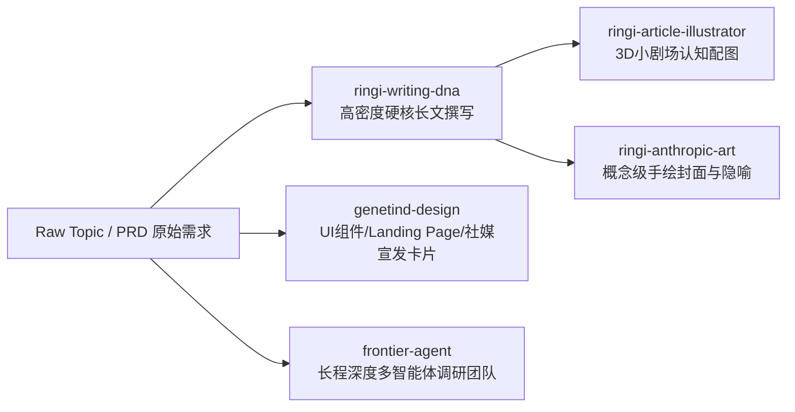

# ⚡ Lilinji's Agent Skills Collection

<div align="center">


<p align="center">
  <strong>面向未来智能体的高阶设计系统、技术配图工坊、硬核写作引擎与运行时套件</strong>
  <br />
  打造高辨识度、工业级、严谨自洽且防 AI 幻觉（Anti-Slop）的生产力武器库
</p>

</div>

---

## 🌟 视觉呈现精选 (Visual Showcase)

本仓库内的 Skills 不仅提供严谨的过程指导，更自带原生训练的工业级资产与生成美学：

| 🎨 3D 小剧场工作流 (`ringi-ip-article-illustrations`) | 📐 智能体执行流卡片 (`ringi-article-illustrator`) |
| :---: | :---: |
|  |  |
| **RAG 检索增强架构 3D 小剧场** | **Agent 自主执行循环与自愈机制** |

| 🏺 Anthropic 编辑插画 (`ringi-anthropic-art`) | 🌌 GeneTind 空间架构 (`genetind-design`) |
| :---: | :---: |
|  |  |
| **Anthropic 官方手绘概念隐喻** | **GeneTind 深色同心径向空间母版** |

| 👓 Ringi 专属 IP（透明方框眼镜） | 🕶️ Ringi 专属 IP（潮酷墨镜版） |
| :---: | :---: |
|  |  |
| **沉稳严谨科研/架构师人设** | **极客硬核黑客/实战排障人设** |

---

## 📂 Skills 全景矩阵

```
lilinji/skills
├── 🎨 视觉设计与品牌工程 (Visual Design & Brand Architecture)
│   └── genetind-design               # 工业级科研视觉设计系统 (Figma tokens, 单字斜体, 3大固定社媒模版, 2.6:1 横幅)
│
├── 🖼️ 个人 IP 与技术配图工作流 (Personal IP & Technical Illustration)
│   ├── ringi-article-illustrator     # [旗舰] Ringi IP × Baoyu 工业级长文配图工作流 (Type × Style 双模态)
│   ├── ringi-ip-article-illustrations# 完整个人 IP 插图系统 (内置立绘+支持自建角色+AI工作流模板)
│   └── ringi-anthropic-art           # Anthropic/Claude 官方手绘编辑概念插画美学引擎
│
└── ✍️ 硬核写作与智能体运行时 (Technical Writing & Agent Runtime)
    ├── ringi-writing-dna             # 专栏级写作 DNA 蒸馏器 (No Naked Formula 2.0, 真实生产事故复盘, 极客大实话)
    └── frontier-agent                # 开源智能体运行时与 TUI 终端 (Stateful ReAct, 多智能体团队, 沙箱隔离)
```

---

## 📋 技能清单与能力一览

| Skill 名称 | 领域分类 | 核心能力 & 触发场景 | 核心亮点与资产 | 查看详情 |
| :--- | :--- | :--- | :--- | :---: |
| **`genetind-design`** | 视觉系统 / UI工程 | **GeneTind 官方视觉设计系统**。<br>“为我设计一个 GeneTind 风格的界面/社媒卡片/Banner” | 包含 Figma 完整色彩色阶、Tinos Italic 单字强调法则、3 大社媒卡片模版、2.6:1 宽幅 Banner、1:1 翠绿波峰矢量母标与 12 套背景构图。 | [进入目录](./genetind-design/) |
| **`ringi-article-illustrator`** | 概念配图 / 个人IP | **[推荐] 工业级技术文章配图工作流**。<br>“为这篇文章配图”、“生成技术插图”、“Ringi 配图” | 整合宝玉 Type × Style 配图六维方法论与 Ringi IP 3D 小剧场，支持流程工坊与核心动作双模态，自动抽取认知锚点。 | [进入目录](./ringi-article-illustrator/) |
| **`ringi-ip-article-illustrations`** | 视觉插图 / 角色系统 | **完整个人 IP 插图系统**。<br>“创建个人角色”、“生成 3D 小剧场技术卡片” | 原生内置 Ringi 角色（透明眼镜/墨镜版），支持从用户照片提取可复用角色设定板，自带 17+ 套常见 AI 架构模板。 | [进入目录](./ringi-ip-article-illustrations/) |
| **`ringi-anthropic-art`** | 概念美学 / 艺术卡片 | **Anthropic / Claude 官方手绘概念插画**。<br>“画一张 Anthropic 风格的概念图”、“手绘隐喻卡片” | 满版纯色底、不规则象牙白承载形、朴拙近黑手绘线条，将抽象分布式系统、算子通信、哲学隐喻转化为高质感扁平艺术卡片。 | [进入目录](./ringi-anthropic-art/) |
| **`ringi-writing-dna`** | 写作引擎 / 风格克隆 | **专栏级写作 DNA 蒸馏与风格克隆引擎**。<br>“以 Ringi 风格撰写深度长文”、“提取这批文章的写作风格” | 原生内置《AI Infra 大话西游之水滴石穿》专栏写作心法（No Naked Formula 2.0、线上事故复盘、5 点速记口诀），支持 6 层写作基因反向蒸馏。 | [进入目录](./ringi-writing-dna/) |
| **`frontier-agent`** | 智能体运行时 / 终端 | **FrontierAgent 智能体运行时与终端系统**。<br>“启动多智能体协作调研”、“运行 frontier-agent 沙箱” | 支持 Stateful ReAct 单兵循环与 Agent Team 多智能体团队，提供 Textual 原生 TUI、三级任务沙箱隔离与差分审计回滚。 | [进入目录](./frontier-agent/) |

---

## ⚡ 推荐协作工作流 (Synergy Workflows)

多个 Skill 组合可实现全自动工业级交付：



1. **顶级技术长文全栈交付**：
   - 使用 **`ringi-writing-dna`** 输出包含「工程矛盾开局、真实生产事故复盘、No Naked Formula 2.0 量纲代入、5点速记口诀」的高密度技术专著正文。
   - 管道化接入 **`ringi-article-illustrator`**，自动提取关键认知锚点并渲染 16:9 哑光黏土 3D 小剧场插图。
   - 使用 **`ringi-anthropic-art`** 为文章生成充满思考深度的 Anthropic 官方风封面概念卡片。

2. **企业级科研与技术产品发布**：
   - 使用 **`genetind-design`** 快速构筑高严谨度、低熵美学的 Web UI 页面。
   - 使用其内置的 3 大固定社媒模版一键导出统一调性的 Twitter/X 与 LinkedIn 宽幅宣发 Banner。

---

## 🚀 多客户端安装指南

### 1. 全量克隆与本地更新
```bash
git clone https://github.com/lilinji/skills.git
cd skills
```

### 2. 部署到各智能体平台

#### 🟢 Google Antigravity / Gemini IDE
将所需 Skill 文件夹复制到 Antigravity 全局配置目录：
```powershell
# Windows PowerShell 示例：安装 genetind-design 与 ringi-article-illustrator
Copy-Item -Recurse "genetind-design" "$HOME\.gemini\config\skills\"
Copy-Item -Recurse "ringi-article-illustrator" "$HOME\.gemini\config\skills\"
```

#### 🟣 Anthropic Claude Code
复制到 Claude 全局 skills 目录：
```bash
cp -r genetind-design ~/.claude/skills/
cp -r ringi-article-illustrator ~/.claude/skills/
```

#### ⚪ Codex / Cursor / Windsurf
直接将仓库或对应目录软链或复制至当前项目的 `.agents/skills/`：
```bash
mkdir -p .agents/skills
cp -r path/to/skills/genetind-design .agents/skills/
```

---

## 🛡️ 设计准则与质量防线 (Quality Gate)

所有 Skill 均遵循严格的工程与审美准则：
- **Anti-Slop 绝对红线**：严厉杜绝 AI 常见的紫色霓虹发光、杂乱嵌套边框、无意义装饰物与浮夸营销套话。
- **渐进式披露 (Progressive Disclosure)**：`SKILL.md` 保持轻量（聚焦核心流程与决策树），具体色值、模板、组件规范归整于 `references/` 文件夹，按需加载，最大限度节省 Context Window。
- **物理资产全自洽**：所有矢量图标（SVG）、背景纹理、CSS 变量、立绘母版均物理内置，支持完全离线生成。

---

## 📄 开源许可证

本项目遵循 [MIT License](./LICENSE)。欢迎 Star 🌟 与 Fork 贡献！
