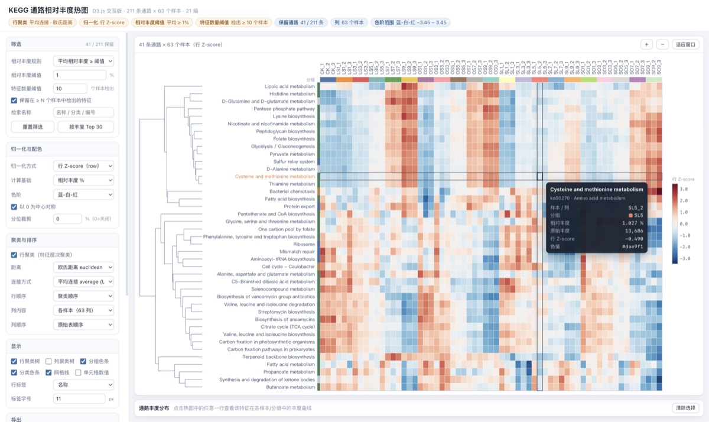
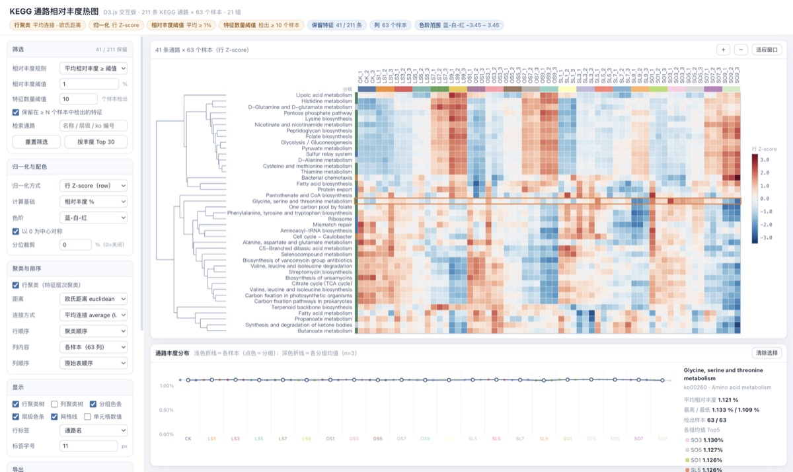

# 📊 abundance-heatmap

> 一张丰度表 → 一个**单文件、离线、双击就能打开的交互热图**。D3 前端渲染：行层次聚类树 + 行 Z-score 归一化 + 双阈值筛选，缩放、悬停读数、点击看曲线、导出 SVG/PNG/TSV 全部可用。

| 悬停读数 + 十字高亮（KEGG 通路 × 63 样本） | 点击任意通路看各样本 / 分组丰度曲线 |
| :---: | :---: |
|  |  |

## 为什么用它

- **完全离线**：产物内联 D3 + 数据 + 交互逻辑，无外链、无 fetch；邮件 / IM 直接发，对方双击即可看，不需要装环境、不需要联网。
- **傻瓜式输入**：Tab / 逗号 / 分号自动嗅探；「特征 × 样本」与「样本 × 特征」方向自动判断；注释列、空值 / NA、千分位、百分号、CRLF/BOM 自动清洗。
- **口径写在界面上**：顶部参数条实时显示归一化方式、两个阈值的口径与保留特征数；阈值随改随算，聚类与配色实时重算。
- **能进论文 / 汇报的导出**：SVG（矢量可编辑）、PNG（2× 位图）、TSV（行序列序与屏幕一致，带参数注释与 BOM，Excel 直接打开）。

## 快速开始

```bash
git clone https://github.com/lilinji/skills.git

# KEGG 通路表 + 分组表（最典型）
bash skills/abundance-heatmap/scripts/run.sh 功能.txt --groups 样本分组.txt
```

默认输出 `./heatmap/<表名>.heatmap.html` 并自动打开浏览器；stdout 会打印识别结果（方向、元数据列、分组、一级分类、列和、默认阈值）。

其它形态：

```bash
# OTU 表（逗号 CSV、含分类学列）——界面文案自动变成「OTU」
bash scripts/run.sh otu_table.csv --entity OTU

# 表是「样本 × 特征」方向（首列是样本名）
bash scripts/run.sh genes_sample_wise.tsv --groups groups.tsv --transpose

# 已经做过 log / z-score 的表：不要列和归一化
bash scripts/run.sh norm_matrix.tsv --no-normalize

# 先试跑：造三种形态的模拟数据
python3 scripts/demo_data.py --outdir /tmp/heatmap-demo
bash scripts/run.sh /tmp/heatmap-demo/ko_table.tsv --groups /tmp/heatmap-demo/groups.tsv
```

## 文档与自检

| 文件 | 内容 |
| :--- | :--- |
| `SKILL.md` | 技能入口：输入要求、参数表、参数口径要点、**踩过的坑**（改代码前必读） |
| `references/parameters.md` | 阈值口径 / 归一化 / 聚类距离与连接 / 配色 / 导出字段的完整说明 + 常见问答 |
| `scripts/build_heatmap.py` | 核心构建脚本（`--help` 看全部参数） |
| `scripts/selftest.sh` | 自检 21 项：分隔符、方向、脏值、分组缺失、参数注入、错误退出码、产物自包含性 |

```bash
bash scripts/selftest.sh      # 改过脚本或 assets 后必须跑一遍
```

## 依赖

`python3 ≥ 3.6`（仅标准库，无第三方）+ 任意现代浏览器。
D3 v7.9.0 已随包内置（`assets/d3.v7.min.js`，ISC 许可，见 `assets/NOTICE.md`），因此产物与构建全程不需要联网。
